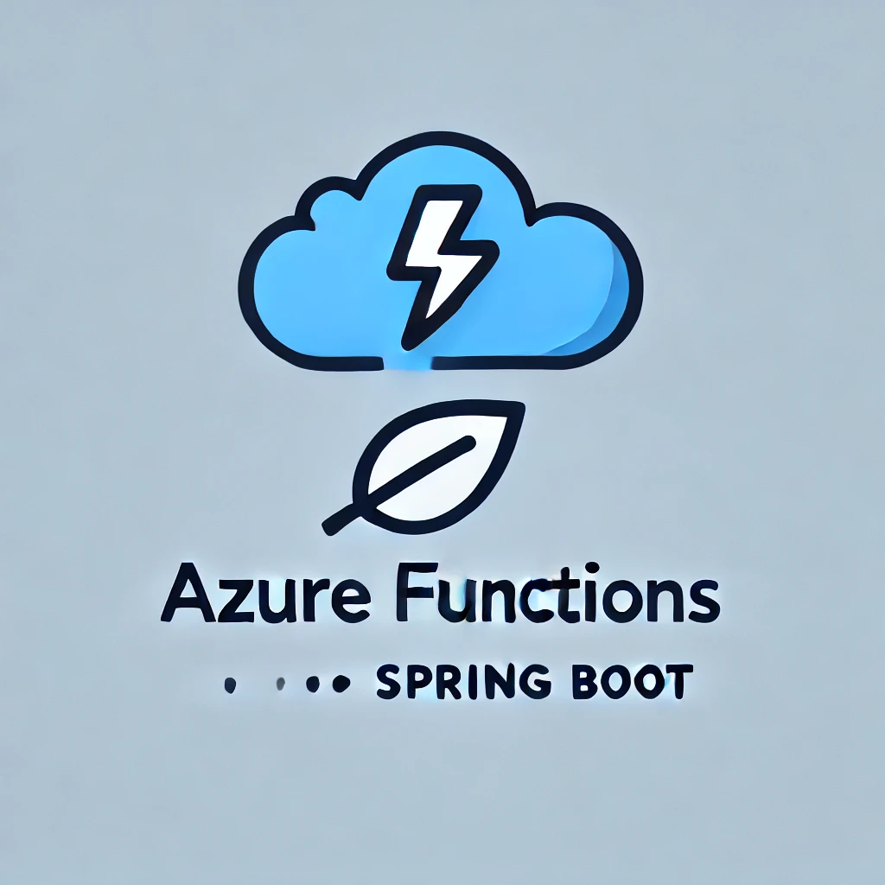

# SpringBoot-Azure-Integration
A Proof of Concept (POC) demonstrating the integration of Spring Boot with Microsoft Azure SDK. 
This project explores how to connect a Spring Boot application with Azure services such as storage, databases, and messaging, using Azure SDK libraries for seamless cloud interaction.

## Azure Function

<p style="text-align: left;"><i>Generated by CGPT</i></p>


### Local Execution
```shell
$  mvn package
$  mvn azure-functions:run
```
To check if it works:
```shell
$ curl  http://localhost:7071/api/egch-aphorism
```

### Deploying on Azure
Before proceeding, update the properties related to the Azure region and your service plan accordingly.
```shell
$ az login
$ mvn azure-functions:deploy
```

## Credits
* https://learn.microsoft.com/en-us/azure/developer/java/spring-framework/getting-started-with-spring-cloud-function-in-azure
* https://medium.com/microsoftazure/create-azure-function-with-spring-cloud-function-ab150216d2bd
* https://github.com/tzolov/hello-spring-function-azure
* https://learn.microsoft.com/en-us/azure/developer/java/spring-framework/getting-started-with-spring-cloud-function-in-azure
* https://learn.microsoft.com/en-us/azure/azure-functions/functions-run-local?tabs=macos%2Cisolated-process%2Cnode-v4%2Cpython-v2%2Chttp-trigger%2Ccontainer-apps&pivots=programming-language-csharp#v4
